## Obsidian 과 Github와 연동하기

---

## 1. Obsidian 새 보관소 생성
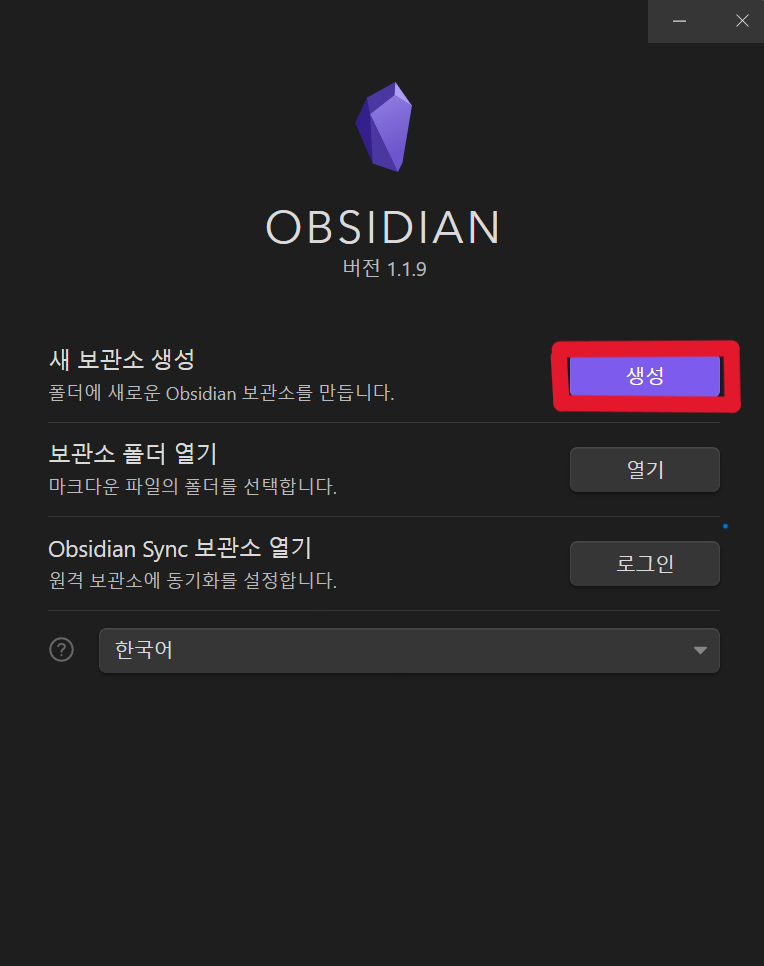
- ##### 새 보관소 `생성` 버튼을 눌러주세요

<br/>
<br/>

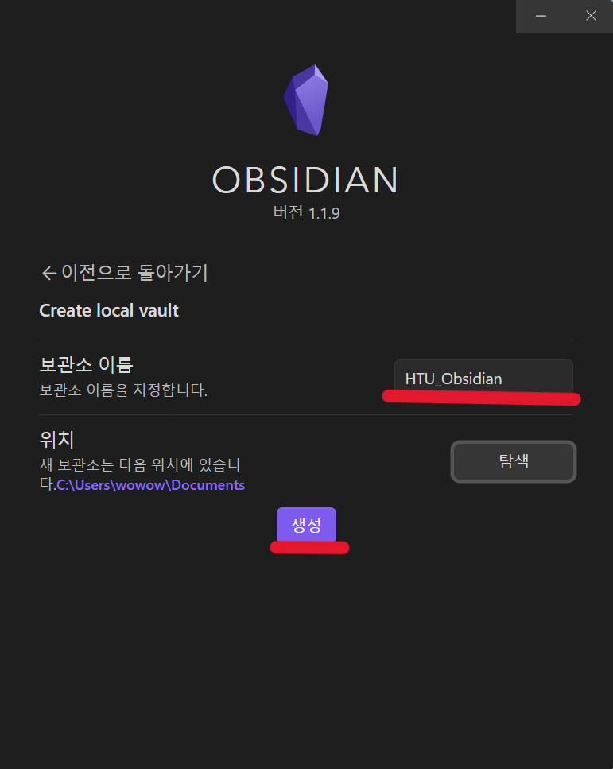
- ### 원하는 보관소 이름과 저장할 경로를 정해주세요
- ### 이름과 경로를 정했으면 `생성` 버튼을 누룹니다

<br/>
<br/>

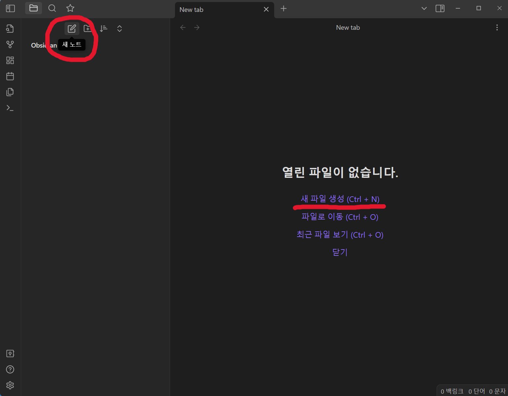
- ### 위 `새 노트`  버튼을 눌러 생성하거나, `새 파일 생성(Ctrl + N)` 버튼을 눌러 파일을 생성하세요

<br/>
<br/>

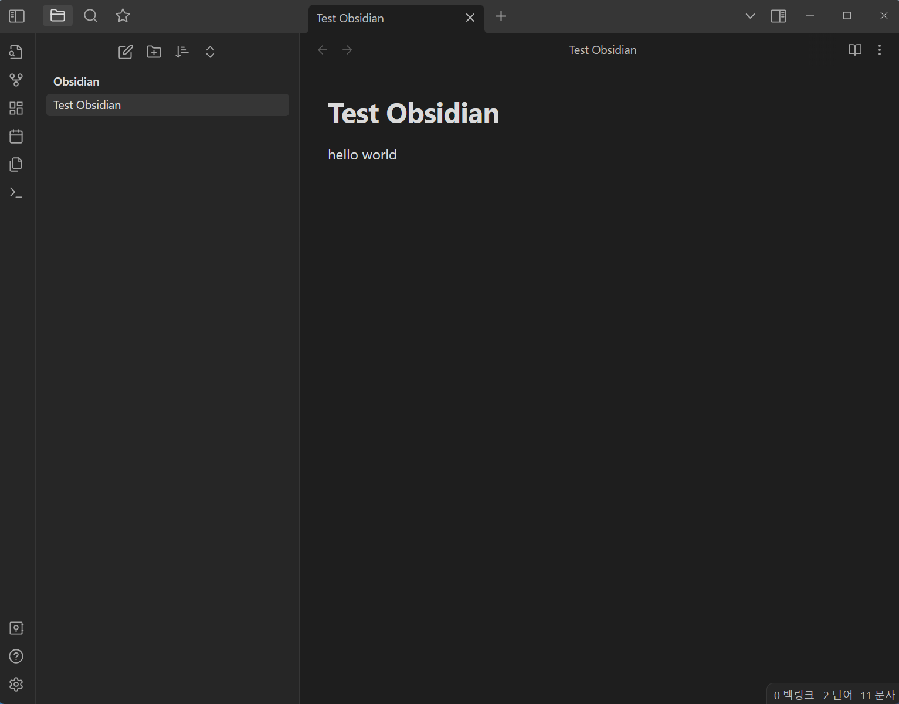
- ### 아무 내용이나 적어 봅시다

<br/>
<br/>

## 2. Obsidian에서 Github 플러그인 다운받기


- ### 좌측 하단의 설정버튼을 눌러 줍시다

<br/>
<br/>


- ### 메뉴창 `커뮤니티 플러그인`을 선택 하고
- ### 오른쪽 커뮤니티 플러그인 `탐색`버튼을 눌러 주세요

<br/>
<br/>

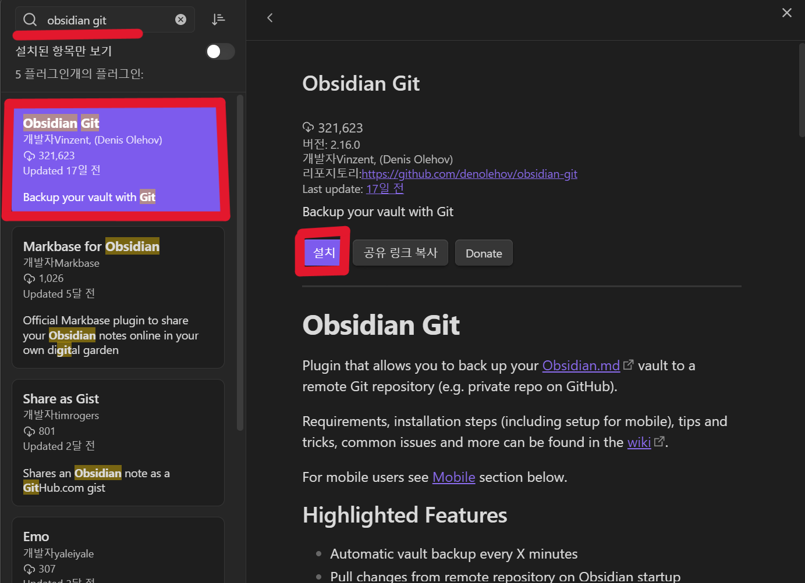
- ### 검색창에 'obsidian git' 이라 검색하시면 맨위에 'Obsidian Git' 을 선택 합니다
- ### 그리고 `설치`버튼을 눌러 설치합니다

- ### 오른쪽 상단에 오류 메시지 나오는데 신경 안쓰셔도 됩니다
  ### 아직 github 와 연동을 안해서 그렇습니다

<br/>
<br/>

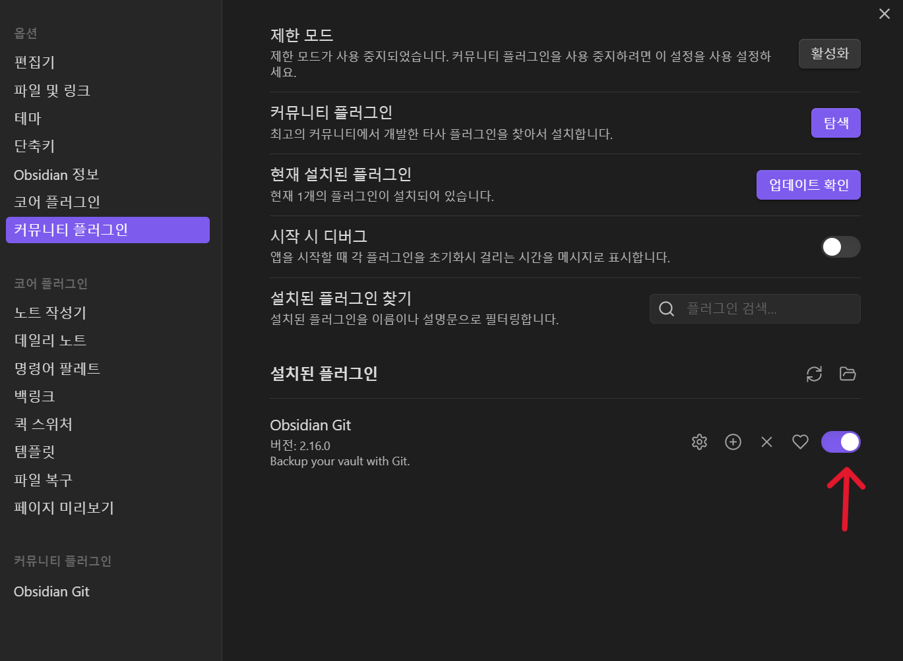
- ### 탐색 창에서 나오시고 밑에 `설치된 플러그인`에서 Obsidian Git을 활성화 버튼을 눌러주세요
  ### (위 사진은 활성화 된 사진입니다)
  
<br/>
<br/>

## 3. gitignore을 이용해서 작업 제외 파일 설정하기

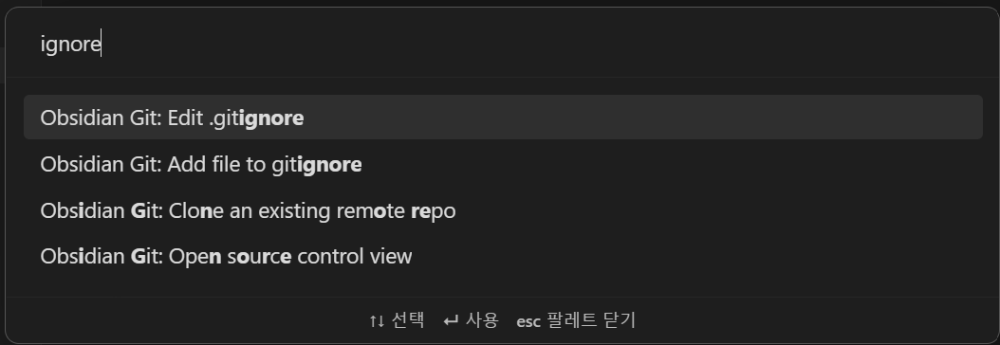

- ### 해당 창은 명령어 팔레트라는 창입니다. 단축키 Ctrl + p 를 누르시고 ignore를 검색해 주세요
- ### 'Edit.gitignore'를 선택해 주세요

<br/>
<br/>

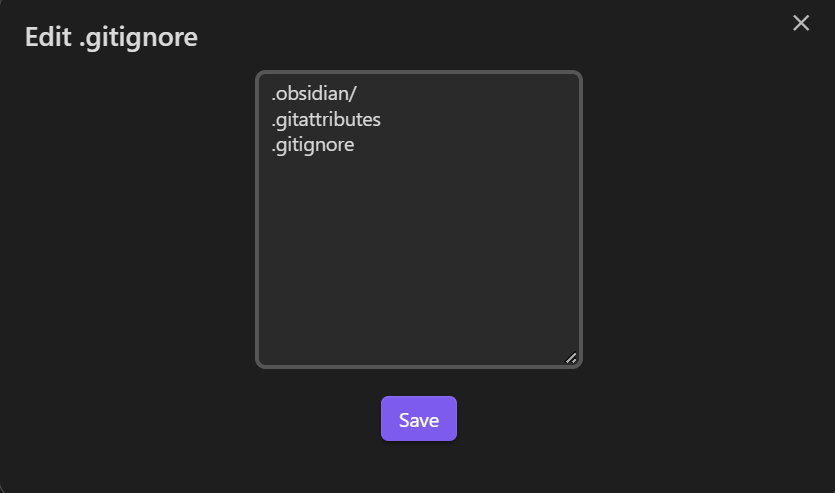
- ### 해당 파일들을 입력해주세요
```
.obsidian/
.gitattributes
.gitignore
```
- ### 폴더는 ' `/` '까지 해주어야 안에 파일들까지 적용됩니다
- ### 앞으로 작업할 때 굳이 보여주지 않아도 되는 파일들은 이런 방법으로 하시면 됩니다


<br/>

#### .gitignore 하는 이유

- ### 쓸데 없는 파일들 까지 github repo 에 올라가기 때문에 미리 작업을 제외시켜줍니다

<br/>
<br/>

## 4. Github DeskTop 이용해서 New repo 만들기

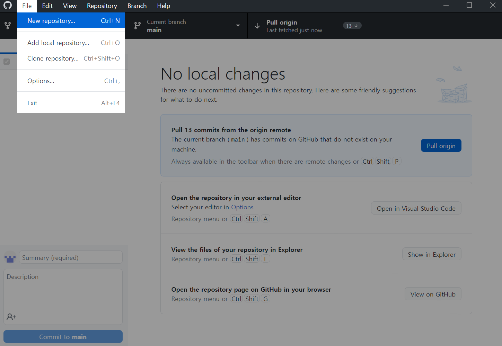
- ### `File`  → `New repository` 을 선택합니다

<br/>
<br/>

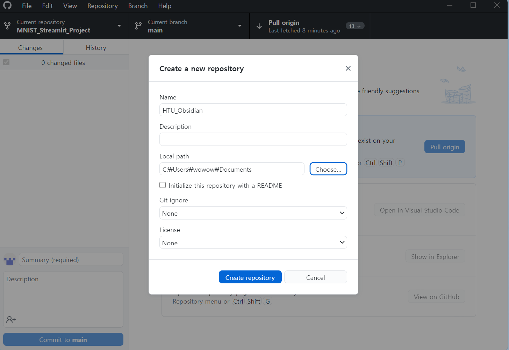
- ### 여기서 중요합니다 repository의 **"Name" 은 반드시 Obsidian 보관소의 이름과 동일**하게 해주셔야 합니다 
  ### (저는 HTU_Obsidian이라는 저장소를 만들었으니 위와 같이 해줬습니다)

- ### 파일 경로는 Obsidian 보관소의 상위폴더로 지정해야 합니다
  ### Obsidian 보관소의 경로가 `C:\Users\wowow\Documents\HTU_Obsidian` 이라면
  ### repository 생성 경로는 `C:\Users\wowow\Documents` 로 지정해 주시면 됩니다

<br/>
<br/>

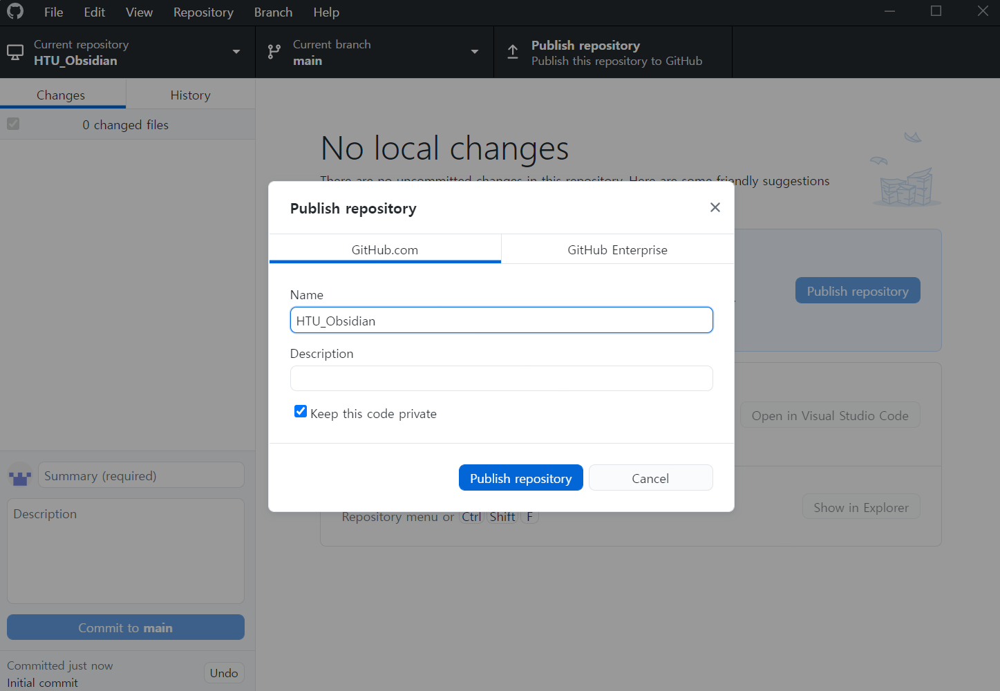
- ### 공개로 게시하고 싶다면 `Keep this code private` **체크를 해제** 하고
- ### `Publish repository` 버튼을 눌러주시면 됩니다

<br/>
<br/>

## 5. Obsidian 에서 commit, push 하기

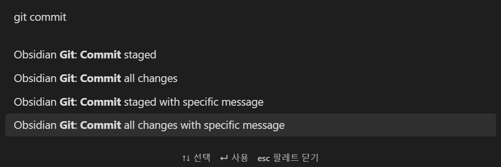
- ### 다시 아까 작업하던 Obsidian으로 돌아와서 Ctrl + p 로 명령어 팔레트 창을 열고

- ### git commit 을 입력합니다

- ### 'Commit all changes with specific message' 는 commit 메시지를 직접 입력 할수 있고

- ### 'Commit all changes'는 자동으로 설정된 commit 메시지로 보내집니다
  ##### (Obsidian Git 플러그인 설정에서 자동 commit 메시지를 변경할 수 있습니다)


<br/>
<br/>

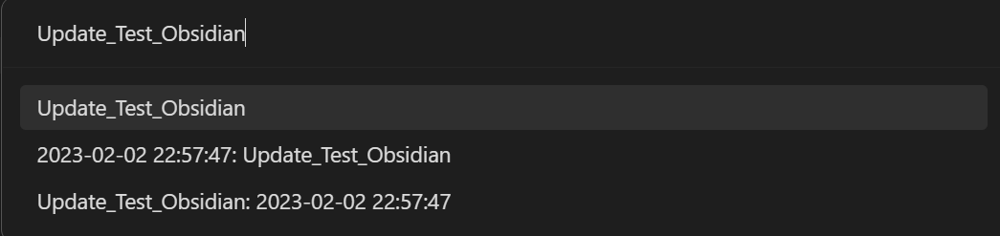
- ### 저는 일단 commit을 직접 입력하였습니다

<br/>
<br/>

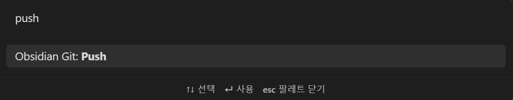
- ### `push`을 입력해 나온  `Git: Push`를 선택합니다

<br/>
<br/>


### 오른쪽 상단에 이런 메시지가 뜨면 성공적으로 push까지 완료 되었습니다

---

- ### 만약 Obsidian에서 내용을 수정하지 않고 Github에서 수정한 경우,
  ### Obsidian 에서 git pull 명령어를 사용하면 github에서 수정된 내용으로 바뀝니다
  
- ### Obsidian Git 플러그인 설정에서 자동으로 commit 과 push를 해주는 기능도 있어
  ### 원하는 방향으로 사용하시길 바랍니다